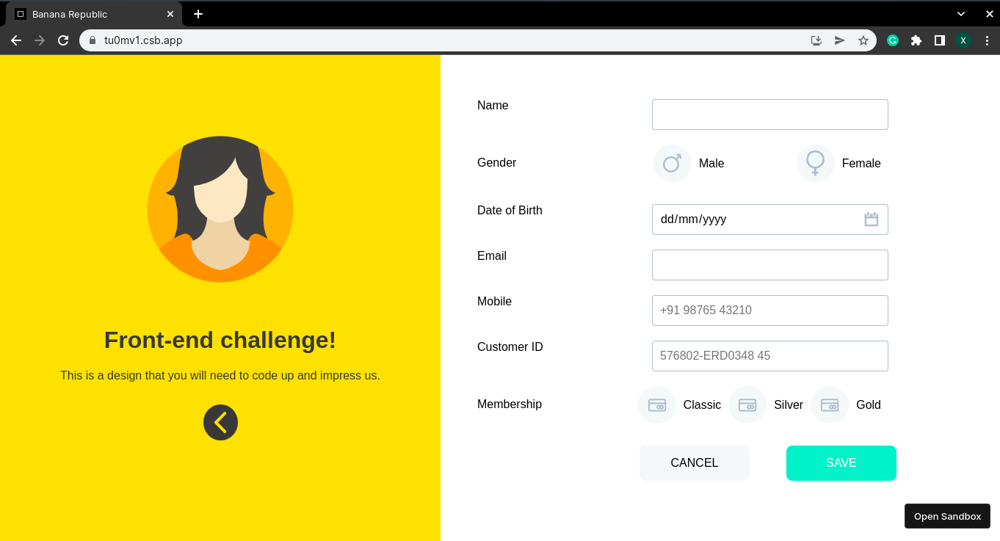
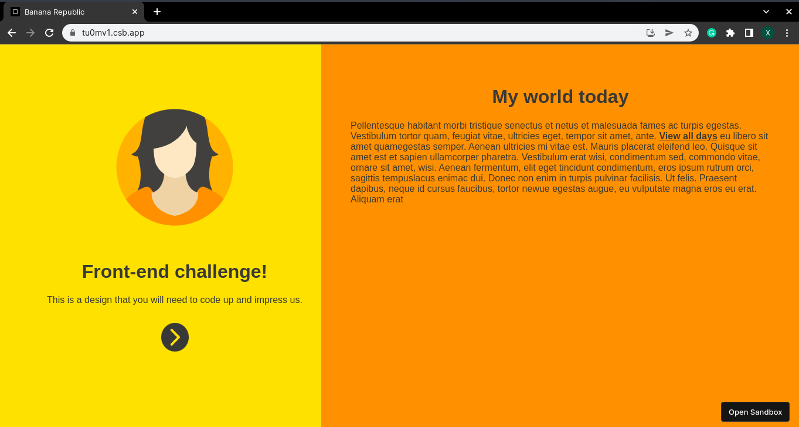

# Banana Republic

Created with CodeSandbox

A frontend-challenge by Platform45.

## Screenshots





## Run Locally

Clone the project

```bash
$ git clone https://github.com/Singatha/banana-republic.git
```

Go to the banana-republic directory

```bash
$ cd banana-republic
```

Install dependencies

```bash
npm install
```

Start the application

```bash
npm start
```

## Lessons Learned

#### What did you learn while building this project?

- React Hooks
- CSS 2D transformations

## Authors

- [@singatha](https://www.github.com/singatha)
